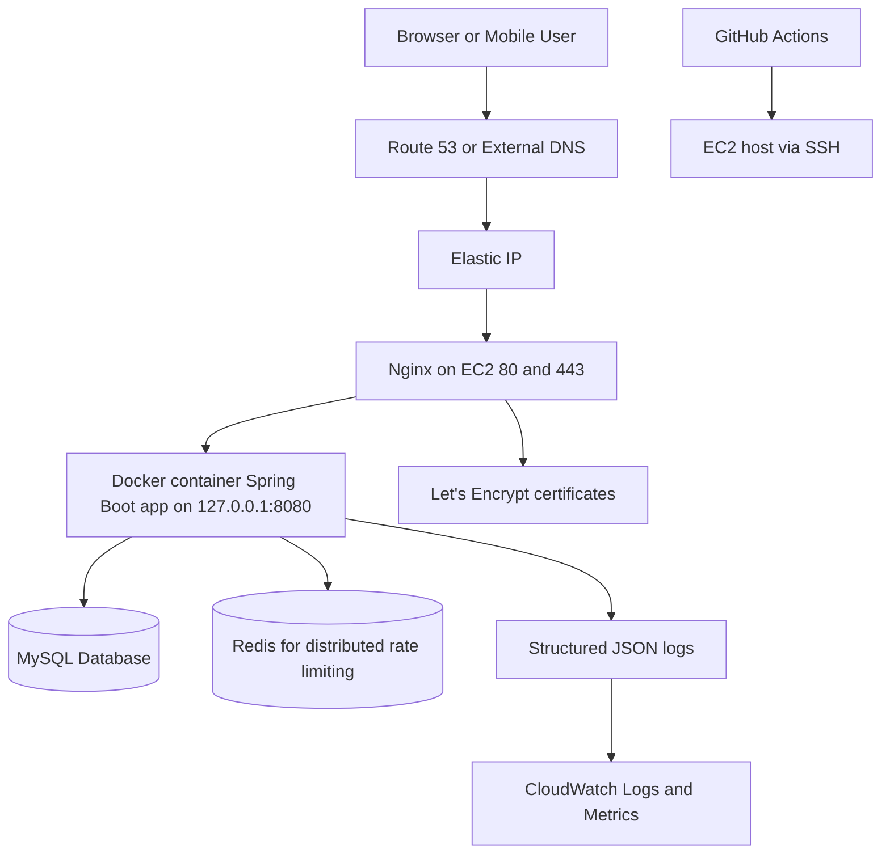

# Production Deployment Runbook

Date: March 6, 2026

This runbook consolidates the production-readiness, testing, deployment, security, monitoring, and disaster-recovery guidance for this repository.

Important implementation note: the current repository does not build or deploy a standalone React frontend artifact. The frontend is served from Spring Boot static assets under `src/main/resources/static`, while Node.js is used only for QA tooling. The AWS and CI/CD guidance below is therefore aligned to the codebase as it exists today. If the frontend is later migrated to a separate React build, replace the frontend deployment portion with a dedicated SPA pipeline such as S3 + CloudFront or a separate container.

Absolute zero deployment risk is not technically achievable in any real production system. The goal of this runbook is to reduce deployment failure risk to an acceptable production level through validation gates, rollback controls, observability, and recovery procedures.

## 1. Production Readiness Checklist

Use this checklist as a release gate. A production release should not proceed until every required item is complete.

### Infrastructure Testing

- [x] Docker image is multi-stage and runs as a non-root user.
- [x] Container health check targets `/health`.
- [x] App container binds to `127.0.0.1:8080` only.
- [x] Nginx reverse proxy terminates TLS and proxies to the app container.
- [x] Nginx enforces HTTP to HTTPS redirect.
- [x] Security groups expose only `22`, `80`, and `443`.
- [ ] EC2 instance uses an Elastic IP.
- [ ] CloudWatch Agent is installed for CPU, memory, disk, and process metrics.
- [ ] Disk usage, inode usage, and Docker log growth alarms are configured.
- [ ] Instance bootstrap steps are codified as cloud-init, Ansible, or an image bake to avoid manual drift.

### Application Testing

- [x] Maven build passes on JDK 21.
- [x] Backend test suite passes with coverage gate.
- [x] Production profile uses `ddl-auto=validate` and disables detailed error exposure.
- [x] Graceful shutdown is enabled.
- [ ] Smoke test runs against the exact image tag intended for release.
- [ ] Release checklist verifies login, registration, public pages, dashboards, and payment/contact flows.
- [ ] Release candidate is tested with production-like environment variables.

### Database Validation

- [x] Schema validation scripts exist under `database/tests`.
- [x] Transaction rollback validation exists.
- [x] Connection pool sizing is defined for production.
- [ ] MySQL backups are automated and restore-tested.
- [ ] Slow query logging is enabled in MySQL.
- [ ] Critical queries have `EXPLAIN` plans reviewed.
- [ ] Schema changes are managed by Flyway or Liquibase before enterprise production rollout.

### API Testing

- [x] Automated backend tests cover authentication, authorization, validation, and error handling.
- [x] Browser E2E tests exist in `qa/e2e`.
- [x] Health endpoints are available for release validation.
- [ ] Contract tests are defined for critical external-facing APIs.
- [ ] Post-deploy smoke tests verify `2xx/4xx/5xx` behavior for key endpoints.
- [ ] Rate-limit behavior is validated from behind Nginx in a staging or production-like environment.

### Security Testing

- [x] Spring Security, JWT validation, RBAC, CSRF controls, and CORS restrictions are implemented.
- [x] Nginx applies TLS 1.2/1.3 and core security headers.
- [x] Image scanning exists in the Docker Hub deployment workflow.
- [x] CodeQL exists in the GHCR workflow.
- [ ] One authoritative release pipeline is selected to avoid conflicting production deployments.
- [ ] Dependency CVE scanning is enforced on every release path.
- [ ] JWT secrets, DB credentials, and admin credentials are rotated and stored outside Git.
- [ ] CSP is tightened further to remove `unsafe-inline` where feasible.
- [ ] Tenant isolation gaps identified in prior audits are fully remediated and regression-tested.

### Performance and Load Testing

- [x] k6 smoke performance test exists.
- [x] JVM container tuning and Hikari sizing are configured.
- [ ] Baseline latency SLOs are defined for public pages, login, and dashboard APIs.
- [ ] Load tests are executed against staging with representative data volume.
- [ ] Soak test validates memory stability, connection leaks, and log growth over multiple hours.
- [ ] Browser performance budgets are defined for first-load and authenticated dashboard flows.

### Backup and Disaster Recovery Strategy

- [ ] Daily automated MySQL logical backup is stored off-instance.
- [ ] Daily EBS snapshot policy is enabled for application host volumes.
- [ ] Backup retention policy is documented by tier.
- [ ] Quarterly restore drill is executed and timed.
- [ ] Recovery runbook includes DNS, certificates, secrets, image tags, and DB restore order.

### Monitoring and Logging Setup

- [x] Spring Boot Actuator is enabled.
- [x] Structured JSON logging exists for production.
- [x] Request correlation via `X-Request-Id` exists.
- [x] Audit logging exists for security-relevant events.
- [ ] Central log shipping to CloudWatch Logs, OpenSearch, or another aggregator is configured.
- [ ] Alarms exist for host saturation, error spikes, and health-check failures.
- [ ] Uptime monitoring exists from outside AWS.
- [ ] Dashboards exist for JVM, container, Nginx, MySQL, and business KPIs.

### Scalability and High Availability Checks

- [x] The application is containerized and stateless enough for horizontal scaling, except for local file upload dependency.
- [ ] Uploaded files are moved from local disk to S3 for multi-instance compatibility.
- [ ] Redis is provisioned and used in production for distributed rate limiting.
- [ ] Database tier is upgraded to Amazon RDS MySQL Multi-AZ for enterprise HA.
- [ ] An ALB plus Auto Scaling Group replaces the single EC2 host for highly available operation.
- [ ] Blue-green or canary deployment strategy is defined for major releases.

Release decision:

- Current repo baseline is suitable for a hardened single-EC2 production deployment after the remaining operational controls are completed.
- It is not yet at enterprise high-availability posture until backups, restore drills, centralized monitoring, and multi-instance file/session strategy are completed.

## 2. Full Testing Strategy

The testing strategy should enforce quality gates at four levels: code, integration, user journey, and production validation.

### Unit Testing

- Backend: JUnit and Spring Boot test slices for controllers, services, validators, utility classes, and security helpers.
- Frontend assets: Vitest tests under `qa/unit` for API helpers, auth behavior, and browser-side scripts.
- Quality gate: block merges on failing unit tests and maintain at least the existing JaCoCo threshold of 80 percent instruction coverage.

### Integration Testing

- Use Spring Boot integration tests to validate authentication flows, role-based access, tenant enforcement, DB access, and filter chains.
- Run against MySQL in CI for production-like SQL behavior where required.
- Continue validating DB schema and transaction semantics using the SQL scripts in `database/tests`.
- Add repository performance tests for the highest-traffic queries and pagination paths.

### End-to-End Testing

- Use Playwright tests in `qa/e2e` for public browsing, auth, security headers, and rate limiting.
- Execute Chromium-only on pull requests and all supported browsers on nightly or scheduled runs.
- Add post-deploy E2E smoke coverage against the live domain using a restricted production smoke account.

### Security Testing

- SAST: keep CodeQL enabled.
- Dependency scanning: add OWASP Dependency Check, Trivy filesystem scan, or Snyk for Maven and JavaScript dependencies.
- Container scanning: keep Trivy image scanning in the deployment workflow and fail releases on critical vulnerabilities.
- DAST: run OWASP ZAP baseline or an equivalent scan against staging before major releases.
- Auth testing: include token tampering, missing tenant context, CSRF bypass attempts, CORS checks, file upload abuse, and rate-limit bypass tests.

### Performance Testing

- Smoke: keep `performance/k6/smoke.js` in CI for main-branch validation.
- Load: create a staging-only k6 profile that simulates concurrent public browsing, login, course browsing, and dashboard requests.
- Stress: run a controlled upper-bound test to understand failure mode and auto-recovery behavior.
- Soak: run at least one 4 to 8 hour test before major production launch.

### Deployment Validation Testing

- Verify the candidate image tag before deployment using container smoke checks.
- After deployment, run:
  - `GET /health`
  - `GET /actuator/health` from localhost only
  - public homepage load
  - login flow
  - one authenticated API call
- Validate Nginx config with `nginx -t` before reload.
- Validate Docker compose with `docker compose config` before applying changes.

### Regression Testing

- Run backend tests on every pull request and main-branch push.
- Run frontend unit tests on every pull request and main-branch push.
- Run browser E2E tests on every pull request.
- Run scheduled nightly cross-browser and performance smoke tests.
- Run full security and restore-drill regression before major releases.

Recommended release test pyramid:

- 70 percent unit tests
- 20 percent integration tests
- 10 percent E2E and production validation tests

## 3. AWS Deployment Architecture

### Current production-aligned baseline

This is the architecture that matches the current repository and deployment assets.



### Enterprise target architecture

For high availability and fault tolerance, evolve the baseline to:

- Route 53 hosted zone and health-checked DNS.
- Application Load Balancer in front of Nginx or directly in front of the app tier.
- Auto Scaling Group with at least two EC2 instances across multiple Availability Zones.
- Amazon RDS MySQL with Multi-AZ enabled.
- Amazon ElastiCache Redis for distributed rate limiting and caching.
- S3 for user uploads and backup artifacts.
- CloudWatch dashboards and alarms, optionally with SNS or PagerDuty integration.
- AWS Systems Manager Parameter Store or Secrets Manager for runtime secrets.

### Component responsibilities

- EC2: runs Docker, Nginx, Certbot, CloudWatch Agent, and optionally local operational tooling.
- Nginx: TLS termination, rate limiting, caching headers, body size limits, reverse proxy.
- Spring Boot container: serves APIs and static frontend assets, enforces auth and business logic.
- MySQL: persistent transactional data. Prefer RDS for managed backups and HA.
- Redis: required for consistent rate limiting once more than one app instance exists.

## 4. Step-by-Step Deployment Guide

### 4.1 Prepare AWS foundation

1. Create a VPC with public subnets for EC2 and, if using RDS, private subnets for the database.
2. Launch an Ubuntu 22.04 EC2 instance or an ASG-managed instance template.
3. Allocate and attach an Elastic IP.
4. Create security groups:
   - Inbound `22/tcp` from administrator IP ranges only.
   - Inbound `80/tcp` and `443/tcp` from the internet.
   - No public inbound access to `8080`, `3306`, or `6379`.
5. Attach an IAM role with least privilege for CloudWatch, SSM, and backup access if those services are used.

### 4.2 Install base software on EC2

1. Install Docker Engine and Docker Compose plugin.
2. Install Nginx.
3. Install Certbot.
4. Install CloudWatch Agent.
5. Create deployment directory `/opt/brightnest`.
6. Create runtime secret file `/opt/brightnest/.env` with strict file permissions.

Suggested environment variables:

```env
SPRING_PROFILES_ACTIVE=prod
PORT=8080
DB_HOST=<mysql-host>
DB_PORT=3306
DB_NAME=shrishail_academy
DB_USER=<db-user>
DB_PASS=<db-password>
JWT_SECRET=<64+ character secret>
JWT_EXPIRATION=3600000
JWT_REFRESH_PEPPER=<optional pepper>
ADMIN_EMAIL=<bootstrap-admin-email>
ADMIN_PASSWORD=<bootstrap-admin-password>
CORS_ORIGINS=https://your-domain.com,https://www.your-domain.com
HTTPS_REQUIRED=true
COOKIE_SECURE=true
RATE_LIMIT_BACKEND=redis
REDIS_HOST=<redis-host>
REDIS_PORT=6379
RESUME_UPLOAD_DIR=/data/uploads/resumes
```

### 4.3 Frontend deployment

Current repo deployment model:

- Frontend pages are bundled as static assets inside the Spring Boot application under `src/main/resources/static`.
- There is no separate React build or Node production server in this repository.
- Deployment therefore consists of deploying one Spring Boot container that serves both frontend assets and backend APIs.

If the frontend is later separated into React:

- Build the React app in CI.
- Publish static assets to S3.
- Put CloudFront in front of S3.
- Route `/api/*` to the backend origin and everything else to the frontend origin.

### 4.4 Backend deployment

1. Build and push the application image using GitHub Actions.
2. Copy or generate `/opt/brightnest/docker-compose.yml` on the server.
3. Pull the exact release image tag.
4. Start or update the app with `docker compose up -d`.
5. Verify `http://127.0.0.1:8080/health` locally before exposing traffic.

### 4.5 Database setup

Preferred production setup:

- Amazon RDS MySQL 8.0 or later.
- Multi-AZ enabled.
- Automated backups enabled.
- Performance Insights enabled.
- Security group allowing access only from the app tier.
- SSL required for DB connections.

Initialization steps:

1. Create the database.
2. Apply `database/schema.sql`.
3. Apply seed data only if strictly required for bootstrap.
4. Run validation scripts in `database/tests`.
5. Verify the application starts with `spring.jpa.hibernate.ddl-auto=validate`.

### 4.6 Docker container configuration

Use the existing hardened settings as the baseline:

- Multi-stage build.
- Non-root runtime user.
- Health check against `/health`.
- Read-only filesystem with `tmpfs` for `/tmp`.
- `no-new-privileges` enabled.
- JSON-file log rotation.
- Loopback-only port binding.

Recommended additions before enterprise rollout:

- Mount a dedicated persistent volume only if local uploads remain necessary.
- Add resource reservations and limits in the runtime platform, not only compose metadata.
- Pin image deploys to immutable SHA tags, never `latest` alone.

### 4.7 Nginx reverse proxy setup

1. Copy `deploy/aws/nginx-brightnest.conf` to `/etc/nginx/sites-available/brightnest`.
2. Create the site symlink in `/etc/nginx/sites-enabled/`.
3. Validate with `nginx -t`.
4. Reload Nginx.
5. Verify:
   - HTTP redirects to HTTPS.
   - `/health` returns successfully.
   - `/actuator/*` is not publicly accessible.
   - Static assets return cache headers.
   - Rate limiting behaves as expected on `/api/auth/login` and `/api/*`.

### 4.8 Domain name configuration

1. Point root and `www` records to the Elastic IP.
2. Lower TTL before migration.
3. Validate DNS propagation.
4. If using Route 53, configure health checks and failover records for future HA expansion.

### 4.9 SSL certificate installation

1. Ensure ports `80` and `443` are open.
2. Use Certbot webroot or Nginx integration to request certificates for root and `www` domains.
3. Enable automatic renewal.
4. Run a dry-run renewal test.
5. Monitor certificate expiry with an external alert.

### 4.10 Environment variable management

Current acceptable baseline:

- Store deployment secrets in GitHub Actions secrets and inject them onto the EC2 host.
- Store runtime secrets in `/opt/brightnest/.env` with root-readable or app-readable least privilege.

Preferred enterprise approach:

- Store secrets in AWS Secrets Manager or Systems Manager Parameter Store.
- Retrieve them at deploy time or bootstrap time.
- Rotate DB, JWT, and admin bootstrap secrets on a defined schedule.

### 4.11 Final go-live validation

1. `docker compose ps`
2. `docker compose logs --tail=200`
3. `curl -fsS http://127.0.0.1:8080/health`
4. `curl -I https://your-domain.com`
5. Login smoke test from a browser.
6. Verify CloudWatch or equivalent log ingestion.
7. Verify backup job status.
8. Record the deployed image SHA and rollback target.

## 5. CI/CD Pipeline Design

### Recommended production pipeline

One release pipeline should be authoritative. This repository currently has overlapping deployment workflows. Consolidate to one pipeline with the following stages:

1. Checkout and dependency cache.
2. Build and unit or integration test on JDK 21.
3. Enforce JaCoCo coverage gate.
4. Run frontend unit tests in `qa`.
5. Run browser E2E smoke tests.
6. Run CodeQL or equivalent SAST.
7. Run dependency vulnerability scan for Maven and Node.js dependencies.
8. Build Docker image.
9. Scan Docker image with Trivy.
10. Push image with immutable SHA tag and optional semver tag.
11. Deploy to staging.
12. Run post-deploy smoke tests.
13. Require approval for production.
14. Deploy to production EC2.
15. Run health gate.
16. If health gate fails, roll back automatically to the previous image.

### GitHub Actions design notes

- Use `concurrency` to prevent overlapping production deployments.
- Use environment protection rules for production.
- Store deploy host, SSH key, registry credentials, and optional cloud credentials in GitHub secrets.
- Upload test reports, coverage, and Playwright reports as artifacts.
- Generate an SBOM and sign container images for stronger supply-chain controls.

### Rollback strategy

- Track the currently running image before deployment.
- Deploy a new immutable SHA-tagged image.
- Poll the local health endpoint for a bounded interval.
- If the health check fails, rewrite compose to the previous image and restart services.
- Keep the previous successful image available in the registry.
- Document manual rollback steps for Nginx, app image, and database.

### Example workflow topology

```text
pull_request -> build/test/security/frontend-unit/e2e
main merge -> build/test/security/image-scan/push-image/staging-deploy/staging-smoke/manual-approval/prod-deploy/prod-health-gate
failure in prod-health-gate -> automatic rollback -> incident alert
```

## 6. Security Best Practices

- Enforce JDK 21 consistently in CI, developer workstations, and build hosts.
- Keep `22` restricted to known administrator IP ranges only.
- Keep `8080`, `3306`, and `6379` private.
- Prefer RDS and ElastiCache over self-managed database and Redis on the app host.
- Use immutable image tags for deployments.
- Rotate JWT secrets and DB credentials regularly.
- Move secrets to AWS-managed secret storage when possible.
- Remove `unsafe-inline` from CSP when frontend refactoring makes that practical.
- Restrict CORS to exact production origins.
- Keep Actuator exposure minimal in production.
- Enforce TLS end to end where possible, including app to DB.
- Add dependency CVE scanning to every release path.
- Add host hardening: unattended security updates, fail2ban or equivalent, and minimal installed packages.
- Move uploads to S3 and run content-type, extension, and malware scanning if file uploads remain part of the platform.
- Keep an audit trail for authentication, admin actions, and security failures.

## 7. Monitoring and Logging Setup

### Logging

- Keep the existing structured JSON logging in production.
- Ship application and Nginx logs to CloudWatch Logs or another centralized platform.
- Retain request correlation using `X-Request-Id`.
- Keep audit logs queryable for investigations.

### Metrics and dashboards

Minimum dashboard set:

- EC2 CPU, memory, disk, network.
- Docker container restarts and health-check failures.
- Nginx request rate, latency, `4xx`, and `5xx` counts.
- Spring Boot JVM heap, GC, thread count, and HTTP response times.
- MySQL CPU, connections, replication status if applicable, slow query count.
- Business KPIs such as registrations, logins, inquiries, and enrollments.

### Alerting

Create automated alerts for:

- Instance unreachable.
- `/health` failure.
- HTTP `5xx` error spike.
- P95 or P99 latency breach.
- CPU over 80 percent for 10 minutes.
- Memory over 85 percent for 10 minutes.
- Disk over 80 percent.
- Certificate expiry within 21 days.
- Backup failure.
- Repeated failed login spikes or rate-limit saturation anomalies.

### Operational tooling

- CloudWatch Agent for host metrics.
- Spring Actuator for application health.
- Prometheus scraping in non-prod or internal-only environments if deeper metrics are needed.
- External uptime monitor for public URL validation.
- Incident routing through SNS, email, Slack, Teams, PagerDuty, or Opsgenie.

## 8. Backup and Disaster Recovery Plan

### Backup scope

- MySQL data.
- Uploaded files.
- Nginx config.
- Docker compose and deployment metadata.
- Runtime environment file or secret source of truth.
- SSL certificate recovery procedure.

### Backup design

- Database:
  - Daily automated RDS snapshot or daily `mysqldump` if self-managed.
  - Point-in-time recovery enabled if using RDS.
  - Weekly restore verification into a non-production environment.
- Files:
  - Store uploads in S3 with versioning enabled.
  - Replicate critical assets across regions if required.
- Host:
  - Daily EBS snapshots for the EC2 instance volumes.
  - Infrastructure configuration stored in Git.

### Recovery objectives

- Target RPO: 15 minutes or better if using RDS point-in-time recovery.
- Target RTO: 1 hour for single-region restoration, lower if HA architecture is implemented.

### Disaster recovery runbook

1. Declare incident and freeze deployments.
2. Identify whether failure is app-only, host-only, data-only, or region-wide.
3. If app-only:
   - Roll back to previous image.
   - Validate health endpoint.
4. If host-only:
   - Launch replacement EC2 from hardened baseline.
   - Reattach Elastic IP if applicable.
   - Restore `/opt/brightnest` configuration.
   - Pull last known-good image.
5. If database corruption or data loss:
   - Restore the latest clean snapshot or point-in-time recovery target.
   - Run schema validation and spot-check critical data.
   - Reconnect the application and validate write operations.
6. If certificates are unavailable:
   - Reissue via Certbot after DNS and Nginx are restored.
7. Run smoke tests and reopen traffic only after validation passes.

### Mandatory drills

- Monthly rollback drill.
- Quarterly DB restore drill.
- Quarterly host rebuild drill.
- Annual disaster-recovery tabletop exercise.

## Recommended Next Actions

1. Consolidate the duplicate deployment workflows into one authoritative production release pipeline.
2. Move backups, monitoring, and secret storage from documented intent into implemented AWS services.
3. Migrate uploads to S3 and database to RDS Multi-AZ before claiming enterprise HA readiness.
4. Add dependency scanning, SBOM generation, and image signing to the final release path.
